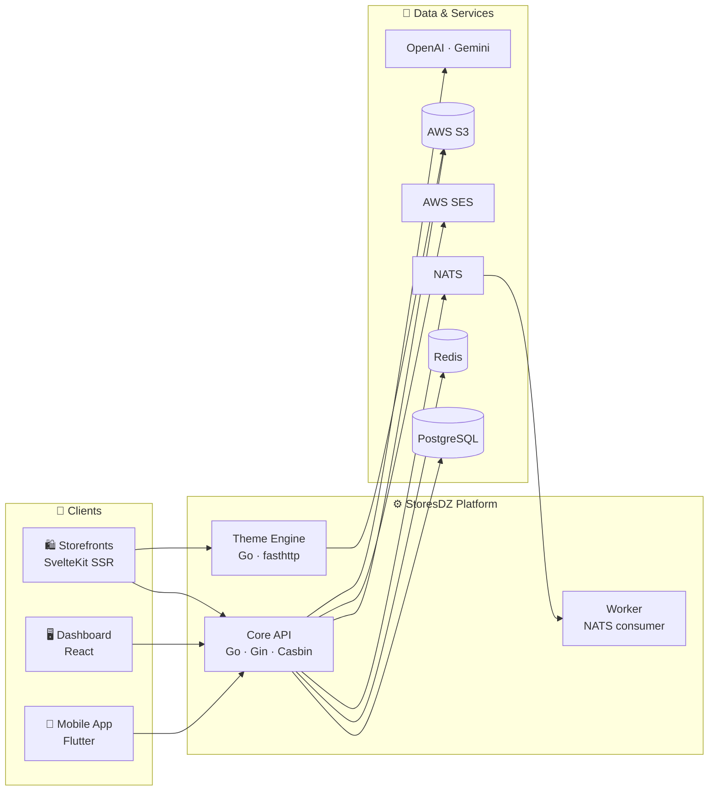

<div align="center">


<br/>

<a href="https://readme-typing-svg.demolab.com">
  
</a>

<br/>

[](https://storesdz.com)
[](https://api.storesdz.com)
[](https://github.com/storesdz)
[](https://storesdz.com)

</div>

---

## 🚀 What is StoresDZ?

**StoresDZ** is a full-stack, multi-tenant e-commerce platform — think *Shopify, but open and built for Algeria*. One platform powers **unlimited storefronts**, each with its own domain, theme, language, products, and delivery rules — all served from a single high-performance Go API.

From merchant onboarding to checkout, from a blazing-fast SSR storefront to a cross-platform mobile app, StoresDZ covers the entire commerce stack — including the Kubernetes infrastructure it runs on.

<br/>

## ✨ Platform Highlights

<table>
<tr>
<td width="50%">

### 🏪 Truly Multi-Tenant
Host-based tenant resolution means every store gets its own domain, data, and experience — all from one deployment.

### 🎨 Dynamic Theme Engine
A dedicated Go (fasthttp) service renders per-store themes on the fly, with settings cached and streamed straight from S3.

### 🌍 Built-In i18n
Storefronts speak **Arabic (RTL), French, and English** out of the box via type-safe inlang/paraglide translations.

### 🚚 Algeria-Ready Commerce
Native **wilaya-based delivery** pricing and **Cash-on-Delivery** flows — the way commerce actually works in DZ.

</td>
<td width="50%">

### 🔐 Secure by Design
JWT + Google OAuth authentication with fine-grained, role-based access control powered by **Casbin**.

### ⚡ Event-Driven Core
**NATS** streams power background jobs and async processing; **Redis** caches the hot paths.

### 🤖 AI-Powered
OpenAI & Google Gemini integrations bring intelligent features to merchants.

### 📊 Observable & GitOps-Ready
Prometheus metrics, Grafana dashboards, ArgoCD deployments, Harbor registry, and Traefik ingress — production-grade from day one.

</td>
</tr>
</table>

<br/>

## 🧩 The Ecosystem

| Project | What it does | Built with |
|:---|:---|:---|
| 🛍️ [**storefront**](https://github.com/storesdz/storefront) | Customer-facing storefronts — multi-tenant, SSR, dynamically themed |   |
| 🖥️ [**dashboard**](https://github.com/storesdz/dashboard) | Merchant admin panel — orders, products, funnels, staff, analytics |    |
| ⚙️ [**backend**](https://github.com/storesdz/backend) | The core API & business logic — the single source of truth |    |
| 🎨 [**theme-engine**](https://github.com/storesdz/theme-engine) | On-the-fly theme rendering service with S3-backed theme storage |    |
| 📱 [**storesdzapp**](https://github.com/storesdz/storesdzapp) | Cross-platform mobile app for iOS, Android, web & desktop |   |
| 📦 [**storesdz-cli**](https://github.com/storesdz/storesdz-cli) | `create-storesdz` — scaffold a new app in seconds |  |
| 🧱 [**storesdz-core**](https://github.com/storesdz/storesdz-core) | Shared SDK & Vite plugin powering the JS ecosystem |  |
| ☸️ [**k8s**](https://github.com/storesdz/k8s) | Infrastructure as Code — ingress, GitOps, storage, monitoring |    |

<br/>

## 🏗️ How It All Fits Together



<br/>

## 🛠️ Tech Stack

<div align="center">

<a href="https://skillicons.dev">
  
  <br/>
  
</a>

**Also in the mix:** NATS · Casbin · sqlc · Traefik · ArgoCD · Harbor · Longhorn · TanStack Query & Router · shadcn/ui · Recharts · Framer Motion · inlang/paraglide

</div>

<br/>

## ⚡ Quick Start

```bash
# 🐣 Scaffold a brand-new app
bunx create-storesdz my-app

# ⚙️ Spin up the backend (Postgres, migrations, codegen, server)
make dev

# 🛍️ Run a storefront / 🖥️ the dashboard
cd storefront && bun install && bun run dev
cd dashboard  && bun install && bun run dev
```

<br/>

## 🤝 Get Involved

We're building StoresDZ in the open and we'd love your help — whether it's a bug report, a new theme, a translation, or a whole feature.

- 🐛 **Found a bug?** Open an issue in the relevant repo.
- 💡 **Have an idea?** Start a discussion — we're listening.
- 🔧 **Want to contribute?** Check out the [contribution guide](https://github.com/storesdz/backend/blob/master/docs/04_CONTRIBUTING.md) to get oriented.

<br/>

<div align="center">

**Made with ❤️ in Algeria 🇩🇿**

[](https://storesdz.com)
[](https://github.com/storesdz)


</div>
